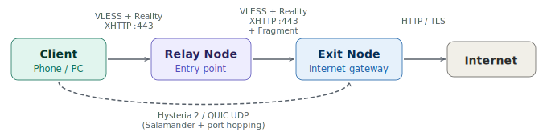
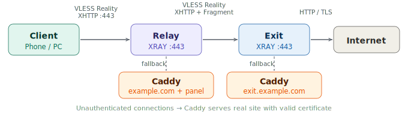
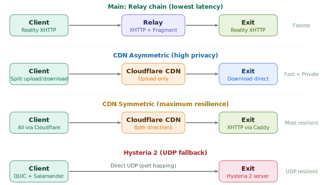
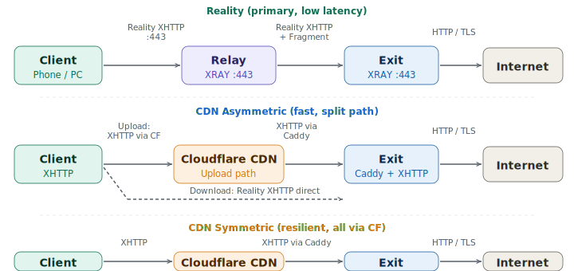

# VLESS Reality Relay — Self-Hosted Encrypted Tunnel

Self-hosted relay infrastructure for encrypted inter-node connectivity. Automated deployment on two VPS nodes.

> **Legal Notice:** This project is intended for lawful use cases only — corporate network segmentation, privacy research, and infrastructure redundancy. Users are solely responsible for compliance with applicable local laws and regulations.

🇷🇺 [Русский](README.md)

## How It Works



The relay node provides network segmentation: clients connect to the nearest server while internet traffic exits through a remote one.


This architecture provides:

- **Resilience** — if the exit node goes down, replace it in one place; clients won't notice
- **Segmentation** — separating entry and exit points means metadata is split across hops
- **Low latency** — clients connect to the geographically closest server

### SelfSteal SNI (optional)

SelfSteal mode aligns your server's domain, IP, and TLS certificate for consistent transport configuration. Caddy serves a real website on your domain, eliminating SNI/IP mismatch.


SelfSteal is fully optional — just press Enter during setup to skip it. When enabled, Caddy also reverse-proxies the management panel and subscriptions.



### CDN Fallback (optional)

Traffic is routed through Cloudflare CDN, providing an alternative delivery path when direct connectivity is unavailable.



CDN Fallback supports two modes. Asymmetric sends outbound traffic through CDN while inbound goes direct (faster). Symmetric routes everything through CDN (maximum resilience). Both profiles are available via subscription.



CDN Fallback requires SelfSteal (needs Caddy) and a separate domain connected to Cloudflare. Cloudflare setup is manual (instructions are shown during installation).

### Direct Exit (automatic)

Direct connection to the exit server without passing through the relay. Single hop instead of two — minimal latency. The link is automatically added to the subscription with the lowest priority: the client uses it only when relay and CDN are unavailable.

```
Subscription (priority order):
  ① Relay → Exit          primary
  ② CDN Asymmetric        fallback (fast)
  ③ CDN Symmetric         fallback (resilient)
  ④ Hysteria 2            UDP channel (Salamander + port hopping)
  ⑤ Direct Exit           fastest, but less reliable
```

### Hysteria 2 (optional)

UDP channel using the Hysteria 2 protocol. Runs over QUIC with Salamander obfuscation (traffic is indistinguishable from random data) and port hopping (client switches between ports every few seconds). Resilient to UDP blocking — no fixed port and no identifiable QUIC headers.

Requires SelfSteal (needs TLS certificate). Link is added to subscription automatically. Hysteria 2 runs as a separate process alongside XRAY — two channels are fully independent.

### DNS Filtering

The exit node uses AdGuard DNS to filter ads and trackers at the DNS level. No client-side configuration needed.


### Features

- **VLESS + XTLS-Reality + XHTTP** — end-to-end TLS 1.3 encryption with XHTTP transport on both hops
- **Multi-tier CDN Fallback** — backup routes through Cloudflare with asymmetric mode
- **Adaptive connection protection** — packet padding and connection multiplexing
- **Hysteria 2 (UDP)** — fallback channel with Salamander obfuscation and port hopping
- **3X-UI panel** — web interface for user management, traffic limits, and monitoring
- **Subscriptions** — automatic configuration updates on client devices
- **SSH hardening + fail2ban + UFW** — automated server security configuration
- **Backup / Rollback** — automatic backups on every update with rollback on failure

## Prerequisites

- **2 VPS servers** running Ubuntu 24.04 LTS (minimum 1 CPU, 512 MB RAM)
  - Relay — nearest server to your clients for minimal latency
  - Exit — remote server (different region or country)
- **SSH keys** configured for both servers (the script disables password login)
- **Domain** (optional) — for subscriptions and/or SelfSteal mode
- **CDN Fallback domain** (optional) — separate domain connected to Cloudflare (free plan). Requires SelfSteal

> **Important:** SSH keys must be configured before running the scripts.

## Preparation

### SSH Keys

```bash
# 1. Generate a key (if you don't have one)
ssh-keygen -t ed25519

# 2. Copy the key to the server (repeat for each)
ssh-copy-id root@<server-IP>
```

After this, `ssh root@<IP>` should work without a password.

### Domain (optional)

If you plan to use SelfSteal, configure DNS A records **before** running the scripts:

| Record | Purpose | Points to |
|--------|---------|-----------|
| `exit.example.com` | SelfSteal on exit node | Exit server IP |
| `example.com` | SelfSteal on relay node (main domain) | Relay server IP |
| `panel.example.com` | Management panel via Caddy | Relay server IP |
| `sub.example.com` | Subscriptions via Caddy | Relay server IP |

Without SelfSteal — a single A record pointing to the relay is sufficient for subscriptions.

## Installation


> Always start with the exit server — the relay needs its connection details.

### Step 1. Exit Server

```bash
apt-get update && apt-get install -y git
git clone https://github.com/nozikov/vless-relay-setup.git && cd vless-relay-setup
chmod +x scripts/*.sh scripts/lib/*.sh
sudo ./scripts/setup.sh exit
```

> **Re-running:** if exit is already set up, the script will suggest `update-exit`. Use `--force` to reinstall. Use `--skip-ssh` to skip SSH hardening.

The script will prompt for settings:

```
3X-UI panel port [34821]:              ← Enter for random port
3X-UI panel secret path [a8Kx...]:     ← Enter for random path
Admin username [admin]:                ← admin username
Admin password:                        ← password (hidden)
Custom SSH port (Enter for default 22): ← SSH port
Domain for SelfSteal SNI (Enter to skip): ← domain or Enter
```

With SelfSteal enabled, the script will also install Caddy, issue an SSL certificate, and offer a choice of site content. It will also ask about CDN Fallback:

```
CDN domain for Cloudflare (Enter to skip): ← CDN domain or Enter
Hysteria 2 UDP port (Enter to skip):      ← Hysteria 2 port or Enter
```

If a CDN domain is provided, the script configures a CDN route through Caddy. Cloudflare setup instructions are shown at the end. Hysteria 2 is installed as a separate process alongside XRAY (UDP, port hopping + Salamander).

The script outputs connection parameters at the end — **save them** for relay setup:

```
  Exit server IP:       185.x.x.x
  Exit UUID:            a1b2c3d4-...
  Exit Reality pubkey:  AbCdEfGh...
  Exit Reality shortId: 1a2b3c4d
  Exit Reality SNI:     exit.example.com
  Exit XHTTP path:     xK9mP2vL
```

These values are also saved to `/root/exit-server-info.txt`.

### Step 2. Relay Server

```bash
apt-get update && apt-get install -y git
git clone https://github.com/nozikov/vless-relay-setup.git && cd vless-relay-setup
chmod +x scripts/*.sh scripts/lib/*.sh
sudo ./scripts/setup.sh relay
```

> **Re-running:** `--force` to reinstall (regenerates all keys). `--skip-ssh` to skip SSH hardening.

The script will ask for exit server parameters (from step 1), then panel settings and (optionally) SelfSteal:

```
Exit server IP:                ← from step 1
Exit server UUID:              ← from step 1
...
Domain for SelfSteal SNI (Enter to skip): ← domain or Enter
```

With SelfSteal enabled, additionally:

```
Domain for 3X-UI panel (e.g. panel.example.com): ← subdomain for panel
Domain for subscriptions (Enter to skip):        ← subdomain for subscriptions
```

Without SelfSteal — the script will only ask for a subscription domain (optional).

### Step 3. Add Users

Open the relay panel: `https://<relay-ip>:<port>/<path>/`

1. **Inbounds** → find your inbound → **+ Add Client**
2. Set email (name), traffic limits, and expiration
3. Copy the subscription link for the user

### Step 4. Client Setup

Share the subscription link with the user. In the app: **Subscriptions → Add → Update → Connect**.

| Platform | App | Download |
|----------|-----|----------|
| iOS | Streisand | [App Store](https://apps.apple.com/app/streisand/id6450534064) |
| Android | v2rayNG | [GitHub](https://github.com/2dust/v2rayNG) |
| Windows | v2rayN | [GitHub](https://github.com/2dust/v2rayN) |
| macOS | V2BOX | [App Store](https://apps.apple.com/app/v2box-v2ray-client/id6446814690) |

## Project Structure


## Management

### Updating Configuration

```bash
cd ~/vless-relay-setup && git pull

# Exit server
sudo ./scripts/setup.sh update-exit

# Relay server
sudo ./scripts/setup.sh update-relay
```

Keys, UUIDs, clients, and statistics are **preserved**. Only the configuration template is updated. A backup is created before each update with automatic rollback on failure.

With CDN Fallback, `update-relay` automatically syncs the CDN link with the current exit UUID. If the exit UUID changes — just run `update-relay`, and subscriptions will update. Users only need to refresh the subscription in their app.

To update binaries (XRAY, 3X-UI, Caddy), add `--upgrade`:

```bash
sudo ./scripts/setup.sh update-exit --upgrade
sudo ./scripts/setup.sh update-relay --upgrade
```

### Uninstalling

```bash
sudo ./scripts/setup.sh uninstall           # with confirmation
sudo ./scripts/setup.sh uninstall --force    # without confirmation
sudo ./scripts/setup.sh uninstall --purge-certs  # also remove SSL certificates
```

SSH keys and `sshd_config` are never removed — server access is preserved.

### Services

```bash
# Exit server
systemctl restart xray && systemctl status xray
journalctl -u xray -f

# Relay server
x-ui restart && x-ui status
x-ui log
```

## CLI Flags

| Flag | Context | Description |
|------|---------|-------------|
| `--force` | setup, uninstall | Skip guard check / confirmation |
| `--skip-ssh` | setup, update | Don't modify SSH configuration |
| `--upgrade` | update | Update binaries (XRAY, 3X-UI, Caddy) |
| `--purge-certs` | uninstall | Remove SSL certificates and acme.sh |

## Security

| Component | Description |
|-----------|-------------|
| SSH | Key-only authentication, passwords disabled, optional port change |
| fail2ban | IP ban after 3 failed SSH attempts for 1 hour |
| UFW | Only required ports open (SSH, 443, panel) |
| 3X-UI | Random port + secret URL path |
| Reality | TLS 1.3 with SNI masking to a legitimate domain |
| SelfSteal | Real website on your domain — full SNI/IP/certificate consistency |
| Routing | Private subnet access blocked (RFC 1918) through the tunnel |
| DNS | AdGuard DNS — ad and tracker filtering |

## Troubleshooting

**Installation logs:**
```bash
ls -la /var/log/vpn-setup-*.log
cat "$(ls -t /var/log/vpn-setup-*.log | head -1)"
```

**Can't connect:**
```bash
# Exit
systemctl status xray
journalctl -u xray --no-pager -n 50

# Relay
x-ui status
x-ui log
```

**Panel not accessible:**
```bash
x-ui status
ufw status
```

**Lost exit server credentials:**
```bash
cat /root/exit-server-info.txt
```

**HTTP 500 when adding a client:**
```bash
# Check xray template in 3X-UI
sqlite3 /etc/x-ui/x-ui.db "SELECT value FROM settings WHERE key='xrayTemplateConfig';" | jq '.api'
# If null — run update to restore the template:
sudo ./scripts/setup.sh update-relay
```

## License

MIT
